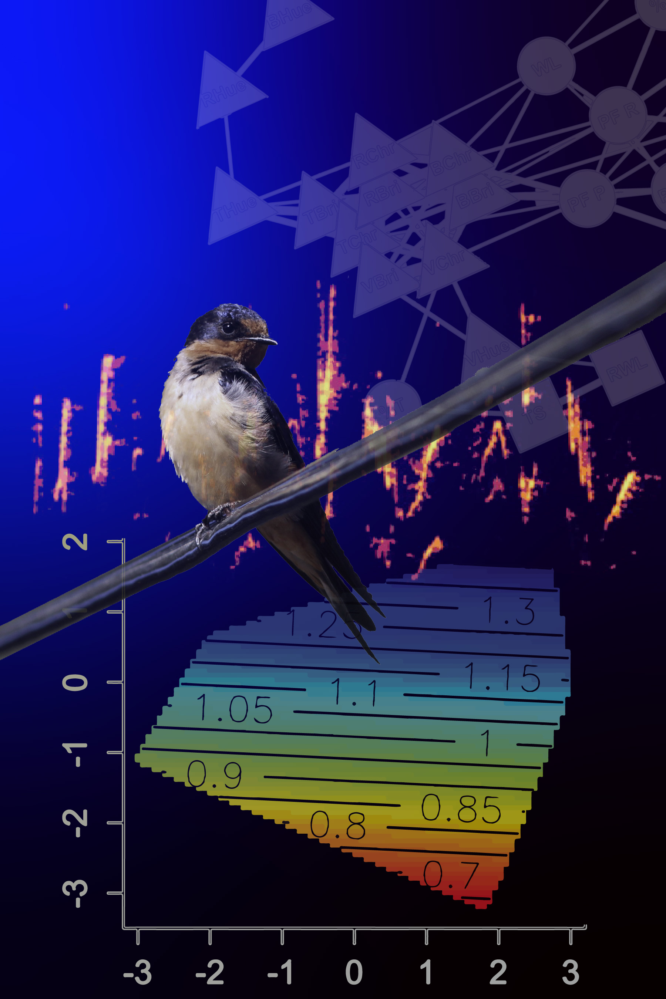

My previous and ongoing research involves multimodal sexual selection, acoustic divergence, and speciation. For my PhD, I studied barn swallows in North America, Europe, and Asia to quantify variation in feather ornaments and song resulting from different targets of sexual selection across populations. As a postdoc at the University of Nebraska, I extended this work by developing a 'phenotype network' approach for visualizing and analyzing the functional evolution of sexual communication signals in barn swallows and Schizocosa wolf spiders.

